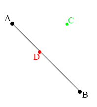

#Lines
For our purposes a line and a line segment are the same thing. Really, a line goes on infiniteley while a line segment simply connects two points. We're going to be using line segments, and calling them lines for convenience.

Let's create a simple line-segment class:

```cs
class Line {
    public Point A;
    public Point B;
    
    public Line() {
        A = new Point(0.0f, 0.0f);
        B = new Point(0.0f, 0.0f);
    }
    
    public Line(Point a, Point b) {
        // TODO
    }
    
    public Line(Line other) {
        // TODO
    }
    
    public void Draw(Color c) {
        // TODO
    }
}
```

The _TODO_ functions are up to you to fill in, this should be pretty simple. The ```GraphicsManager``` already has a draw line function you can utilize.

##Length
One of the most common things to know about a line is how long it is. Finding the length of the line is more or less the same as solving the Pythagorean theorem. [Watch this video](https://www.youtube.com/watch?v=Mzd1UgemJPM) explaining how to derive the formula. [This is also a good article](http://www.regentsprep.org/regents/math/geometry/gcg3/ldistance.htm) on the topic, but i think the video explains it the best.

Now, go ahead and add the following getters to our ```Line``` class:

```cs
public float LengthSquared {
    get {
        // TODO
    }
}

public float Length {
    get {
        // TODO
    }
}
```

###Squared Length

Why do we need both Length and LengthSquared? Shouldn't length be enough? Well, it is... but the square root function (```Math.Sqrt```) is slow / expensive. You should avoid using the square root as much as possible. How does LengthSquared help?

Let's say you have a line, that is the distance from your character to lava. If the line is less than 5 pixels, the character is burned. You could write:

```
// This line is long, you may need to scroll right
if (new Line(character.Position, lava.Position).Length < 5) {
    character.Burn();
}
```

But that would be expensive. Instead, you could move the whole test into a squared space. ```Length < 5``` is the same as ```Length Squared < 5 Squared```, which becomes:

```
// This line is long, you may need to scroll right
if (new Line(character.Position, lava.Position).LengthSquared < 5 * 5) {
    character.Burn();
}
```

It might not look like much of a change, but you just saved almost half a millisecond!

##Slope
Finding the slope of a line is not all that useful. I think during my five year career i've used the formula all of one time. After knowing the length of a line the slope is easy, no video this time, just [have a look at this article](http://www.coolmath.com/algebra/08-lines/06-finding-slope-line-given-two-points-01). The slope of the line is represented by M.

```cs
public float Slope {
    get {
        // TODO
    }
}
```

##Closest (Nearest) Point
Given a point and a line, finding the cloest point on the line to that point is **VERY** important. It's the basis of detecting many, many types of collisions!

This is essentially the problem we are trying to solve. Given a line defined by points **A** and **B**, and given a point **C**, find the point (**D**) on line _AB_ that is closest to point **C**.



###Math
[This video](https://www.youtube.com/watch?v=NFSdyike7g8) explains how to do what we are trying to do mathematically. After watching that video i could find the nearest point on paper, but not in code... This is often the case with math.

[This article](http://ericleong.me/research/circle-line/#the-closest-point-on-a-line-to-a-point-algorithm) does a torough job explaining what's going on, but the math behind it is a bit hard to follow.

###Code
The thing is, using calculus finding the closest point on a line is very, very difficult. Using Linear Algebra, the problem become super simple. We will re-visit this problem once in the Linear Algebra section.

Until we cover Linear Algebra, i'll provide the function implementation for you:

# TODO: Gabor, Test!

```cs
Point ClosestPoint(Point p) {
    Point c = new Point(B.X - A.X, B.Y - A.Y);
    Point v = new Point(p.X - A.X, p.Y - A.Y);
    
    float vdc = v.X * c.X + v.Y * c.Y;
    float cdc = c.X * c.X + c.Y * c.Y;
    
    float d = vdc / cdc;
    if (d < 0.0f) {
        d = 0.0f;
    }
    if (d > 1.0f) {
        d = 1.0f;
    }
    return new Point(a.X + c.X * d, a.Y + c.Y * d);
}
```