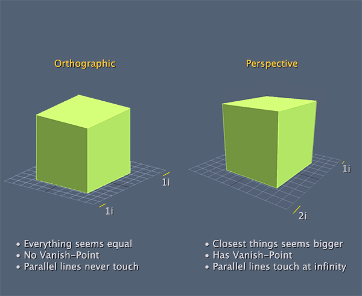
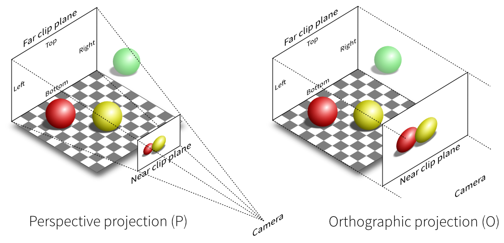

#And we're back
After taking a little deep-dive to explore the transformation pipeline in depth, let's finish our discussion of coordinate systems.

When you are writing your 3D programs, remember that these transformations execute in a specific order. The modelview transformation execute before the projection transformations; However the viewport can be specified any time and OpenGL will automatically apply it at the right time.

Let's re-visit this figure:


## Eye coordinates
One of the most critical conepts to transformations and viewing in OpenGL is the concept of the __camera__, or eye coordinates. In 3D graphics, the currrent viewing transformation matrix, which converts world coordinates to eye coordinates defines the cameras position and orientation. In contrast, OpenGL converts world coordinates to eye coordinates with the __modelview__ matrix. 

When an object is in eye coordinates, the geometric relationship between the object and the camera is known, which means our ojects are positioned relative to the camera. This is important to render correctly. 

To get an object into eye coordinates, multiply it with the inverse of the cameras world transform (the view matrix)

This is the camera's world position, after it is multiplied with the view matrix (inverse of the cameras model matrix)


## Viewing Transformations
We know that the view matrix is the inverse of the cameras world transformation. But how do we position the camera? How to we get the initial world transform for a camera? There are two general ways of doing this

* By using a function such as ```LookAt```, this will specify a position and a direction to look and return the inverse of a matrix created from that.
* By treating the camera as any other object and giving it a model matrix. This model matrix can then be inverted to get the view matrix.

Both of these methods actually use the same math, so it's going to be pretty easy to work with them. We will walk trough how to construct a ```LookAt``` function later.

## Modeling transformation
The modeling transformation allows you to position and orient a model by moving, rotating and scaling it You can perform these operations one at a time or as a combination of events. 


The order in which you specify modeling transformations is very important to the final rendering of your scene. (remember, order of matrix multiplication matters)


Rotating an object first, then translating it will give a very different result than translating an object and then rotating it. So, what's the proper order to transform your primitives? Well that depends on the result you want to get. But in general, multiplication order is accepted as:

* First Scale
* Second Rotate
* Lastly Translate

## Projection transformations
The projection transformation defines the viewing volume and clipping planes. It's performed after the model and view transformations. You can think of the projection transformation as determening what belongs in the view volume.

OpenGL performs two types of projections:

* __perspective projection__ This type of projection shows 3D worlds exactly as you see things in real life. With perspective projection, objects that are farther away appear smaller than objects that are closer to the camera. 
* __orthographic projection__ This type of projection shows objects on screen in their true size, regardless of distance from camera. This projectionction is used for HUD's, 2D games and isometric games.

Here is an example of looking at two objects from the exact same position with the exact same orientation. The only difference is one is looking with perspective, the other is looking orthographic:



This is how the respective cameras see the world:



## Viewport Transformations
The last transformation is the _viewport transformaton_ This transformation maps clip coordinates created by the perspective transformation onto your windows rendering surface. You can think of the viewport transormation as determening where on screen the final pixels will go